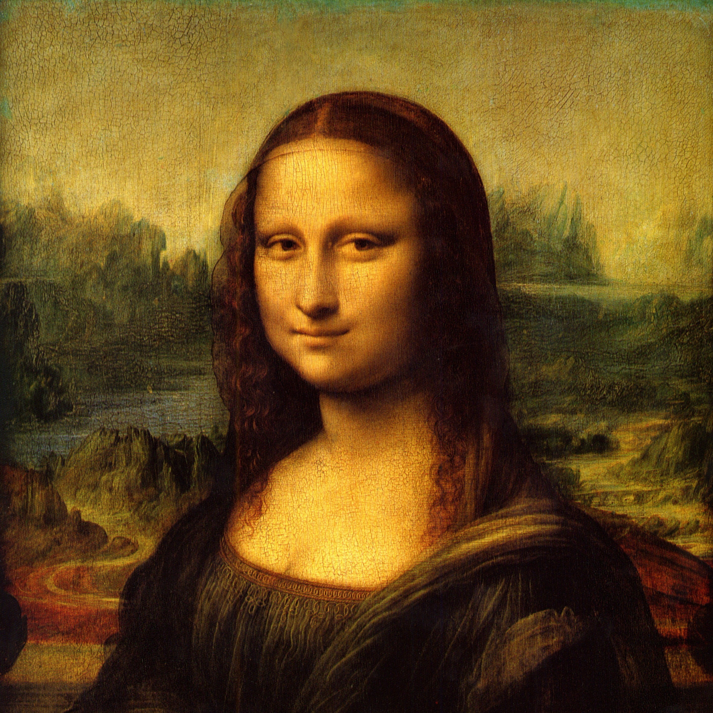
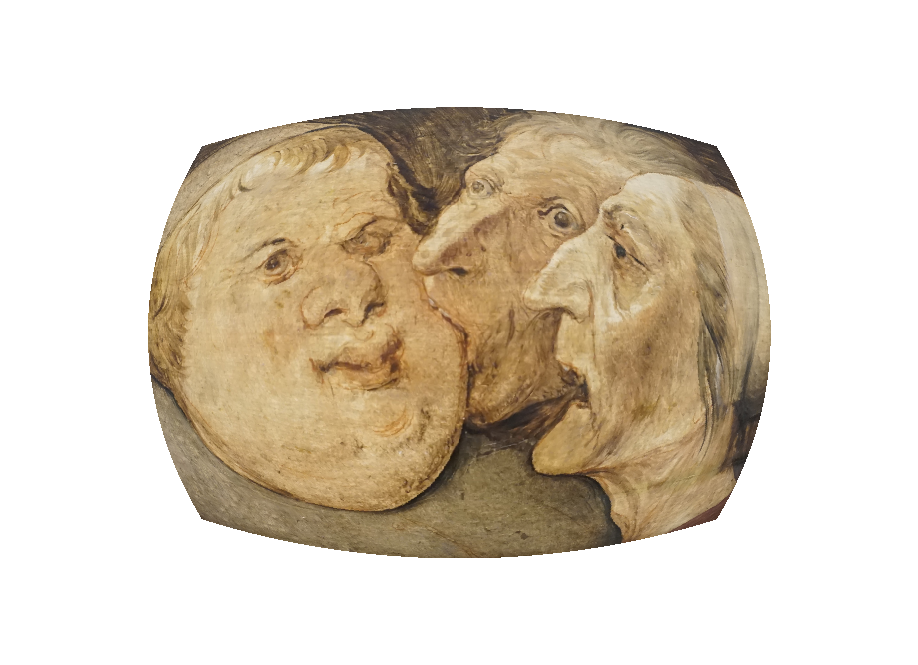
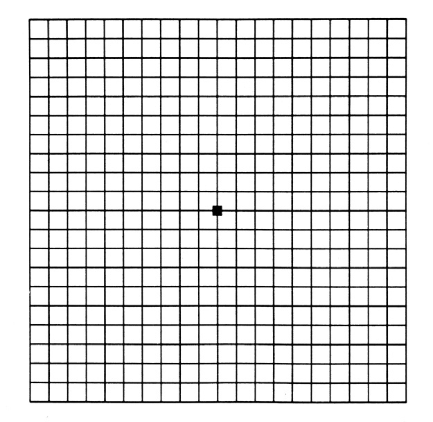
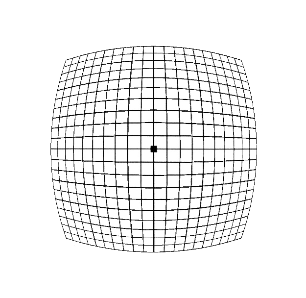

# iFish  

### Apply Fish Eye effect to your photos 

#### Before


#### After
  

OR

#### Before


#### After
  

You can control the amount of distortion.
You can also apply "reverse-fish" (rectilinear lens) by specifying negative distortion.

For usage: `python3 fish.py -h`

### Dependencies
[numpy](https://numpy.org/) and [imageio](https://pypi.org/project/imageio)
```bash
pip3 install numpy imageio
```
