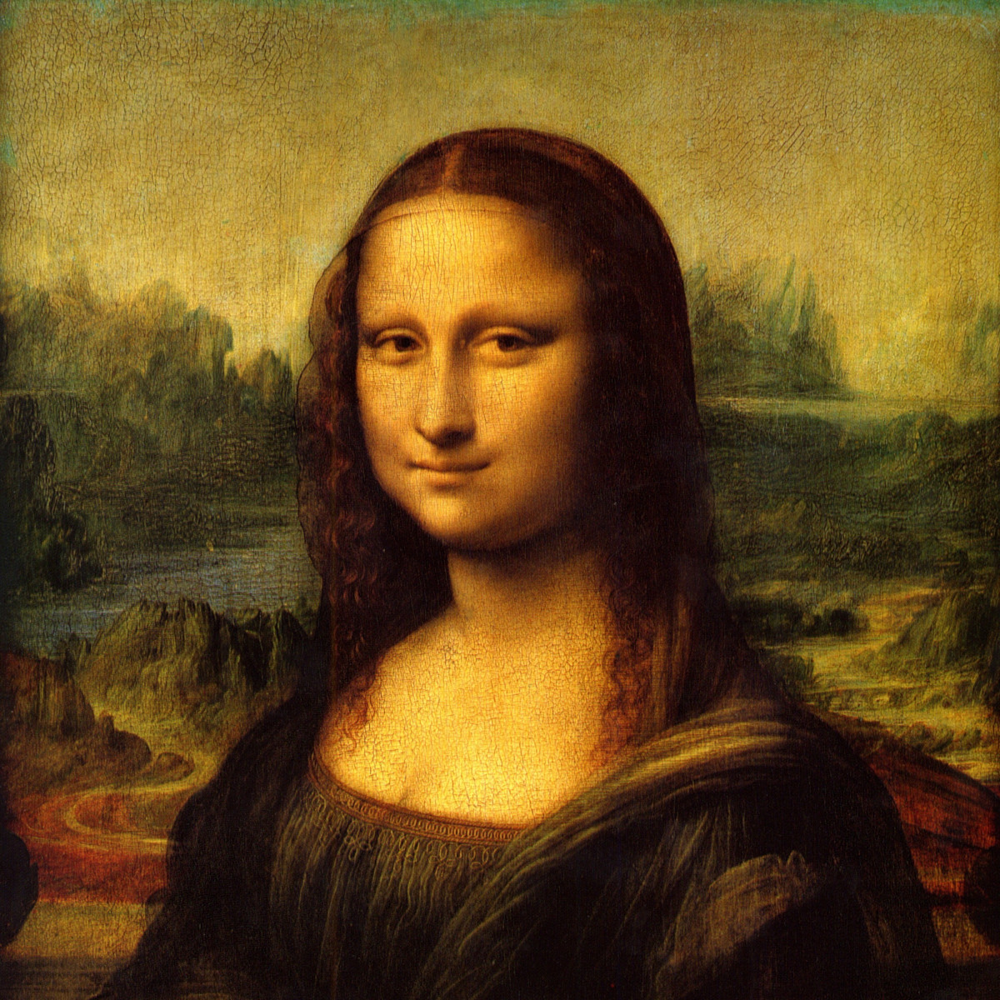
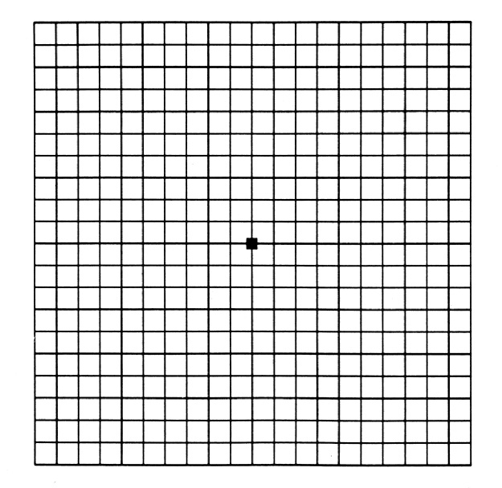
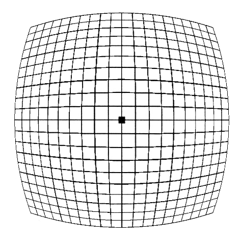

# iFish

### Apply Fish Eye effect to your photos

A naive implementation that moves pixels from/to the center based on a 'distortion' value.

#### Before


#### After


OR

#### Before


#### After


You can control the amount of distortion.
You can also apply "reverse-fish" (rectilinear lens) by specifying negative distortion.

### Usage:

#### Cmdline:
`python fish.py -h`

#### Local Web Interface with [streamlit](https://streamlit.io/)
`streamlit run streamlit_app.py`


### Dependencies
```bash
pip install -r requirements.txt
```
